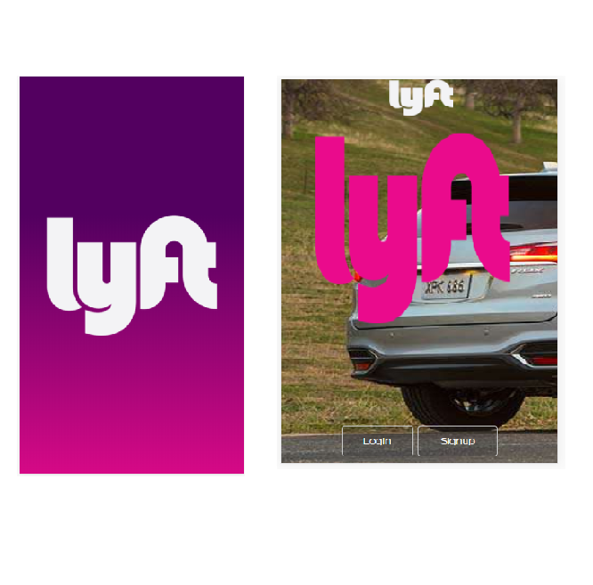
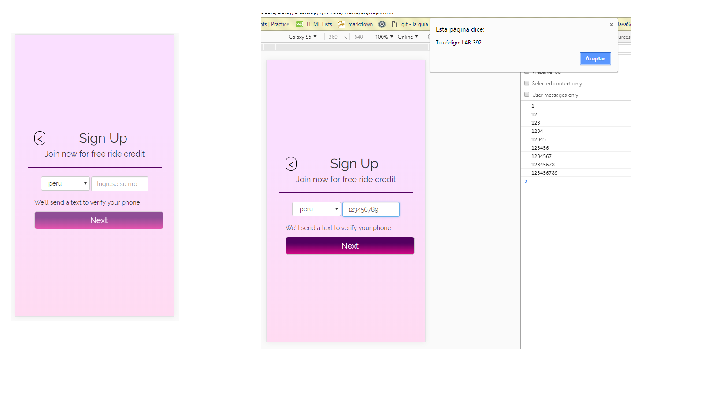
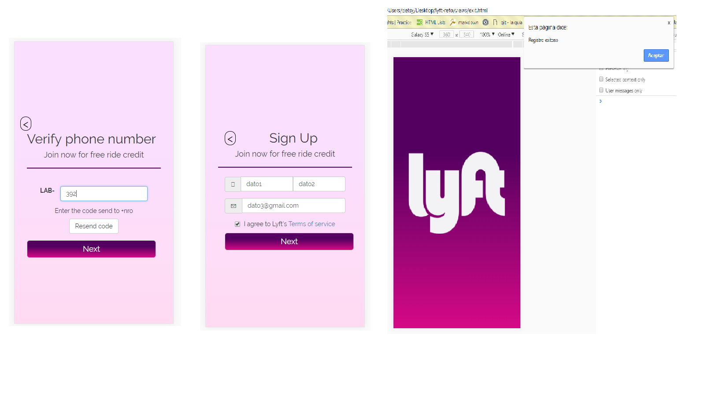

## Lyft

Realización del reto de cod.

### Archivos utilizados

+ Css: main
+ Html: index
+ Framework: bootstrap 3
+ Jquery

### Vista previa:
+ Phone

### Bibliografía:

+ https://es.stackoverflow.com/questions/52100/como-guardar-datos-desde-un-formulario-a-una-tabla-moment%C3%A1neamente
+ https://desarrolloweb.com/articulos/763.php